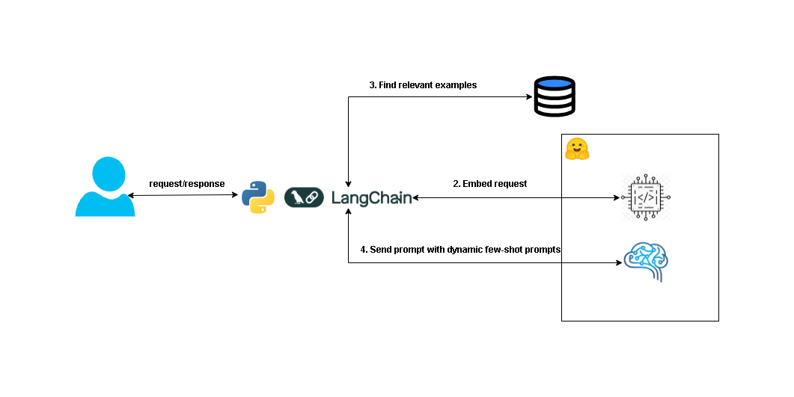

# Dynamic Few-Shot Prompting for AI Agents

This repository demonstrates how to implement **dynamic few-shot prompting** for AI agents in customer support. The solution dynamically selects relevant examples based on user input, optimizing response accuracy and efficiency.

## High Architecture Overview


## Getting Started

### Prerequisites

- Python 3.x
- HuggingFace account with an API token

### Installation

1. Clone the repository:
   ```bash
   git clone https://github.com/yourusername/dynamic-few-shot-prompting.git
   cd dynamic-few-shot-prompting

2. Install dependencies:
    ```bash
    pip install -r requirements.txt
    ```

3. Set up your HuggingFace API token:
    ```bash
    export HUGGINGFACEHUB_API_TOKEN=your_api_token
    ```

### Usage
The step-by-step code implementation is explained in the [blog post](https://medium.com/@stefansipinkoski/optimizing-ai-agents-with-dynamic-few-shot-prompting-585919f694cc). Follow the instructions to set up embedding models, create vector stores, generate dynamic prompts, and get AI responses.

### Contributing

Feel free to fork the repository, make improvements, and submit pull requests. If you encounter issues or have suggestions, open an issue.
